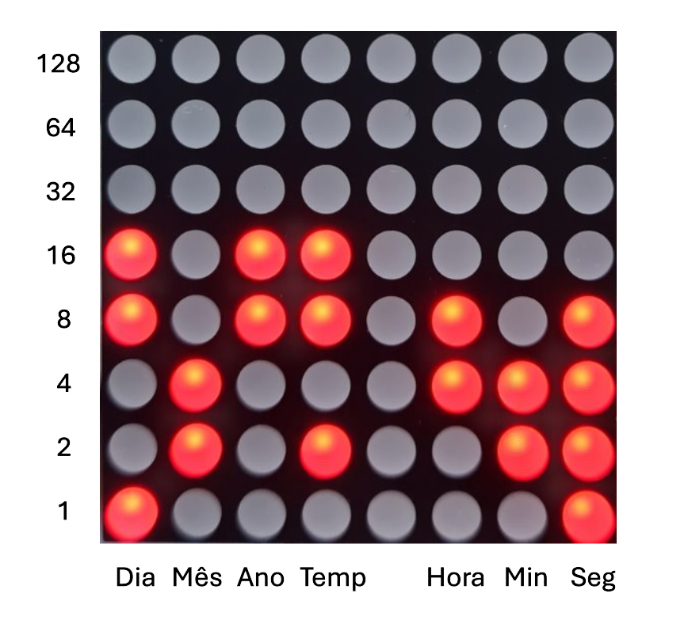
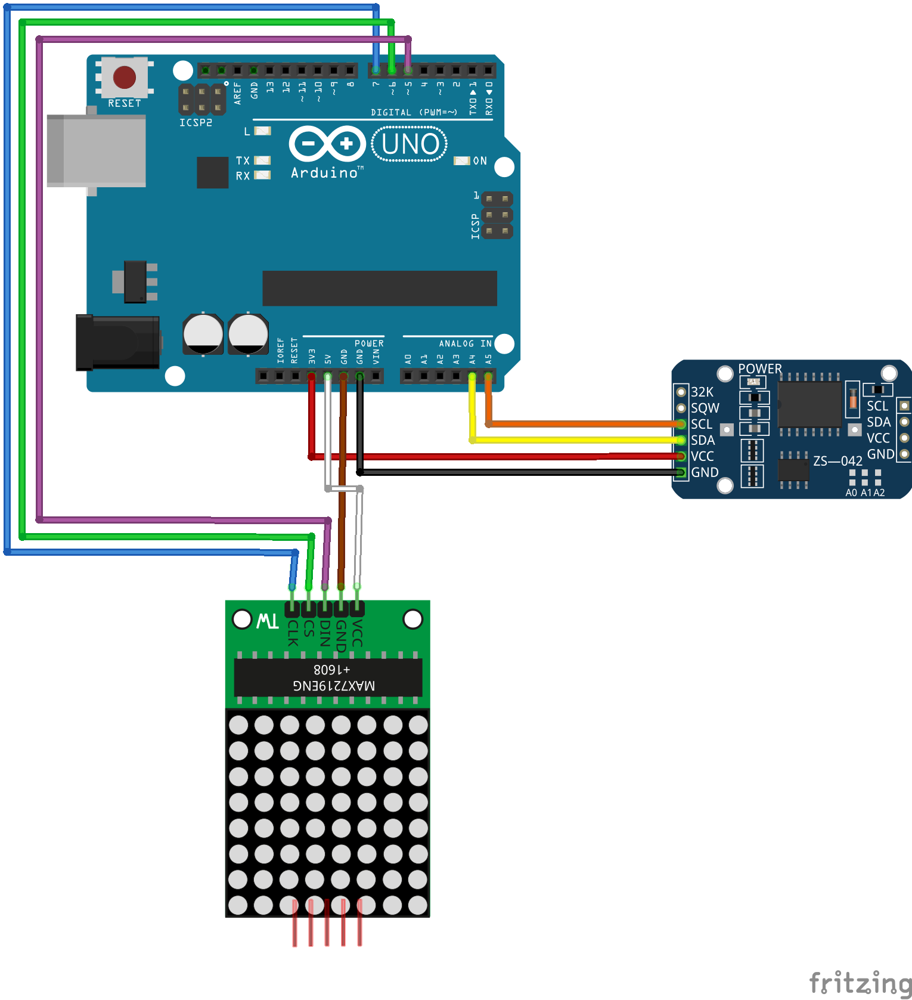
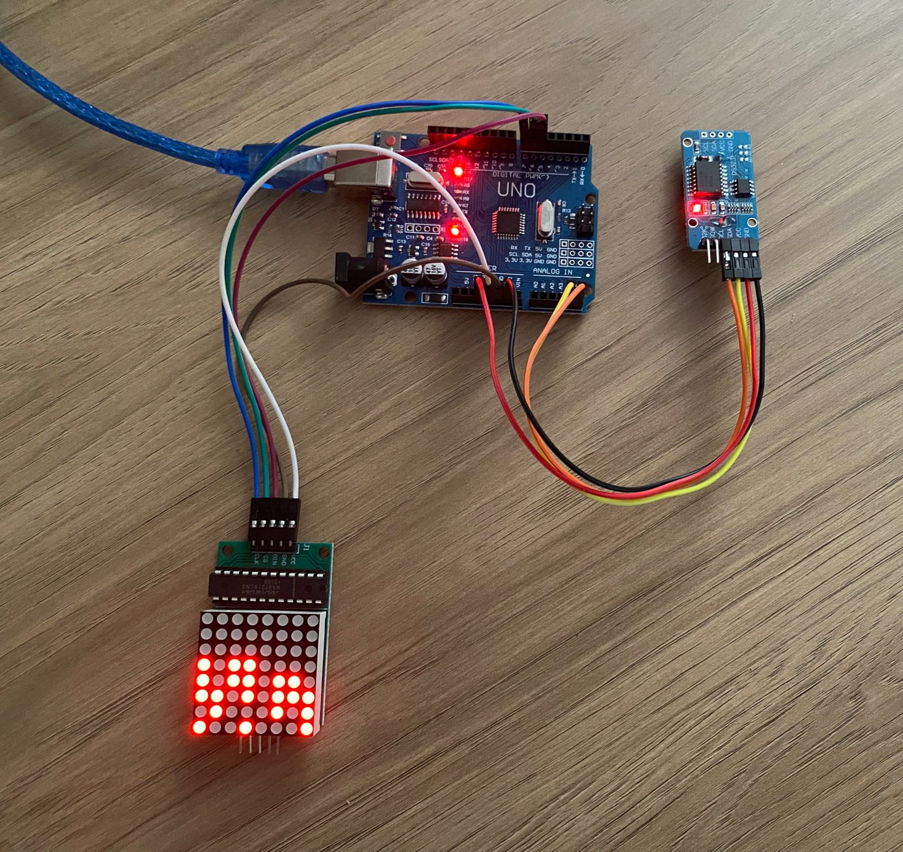
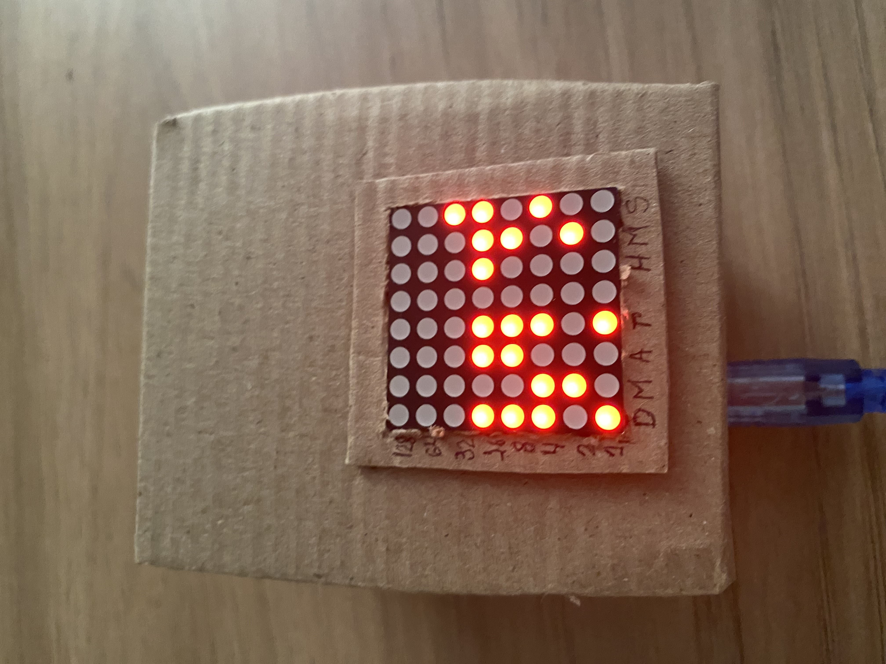
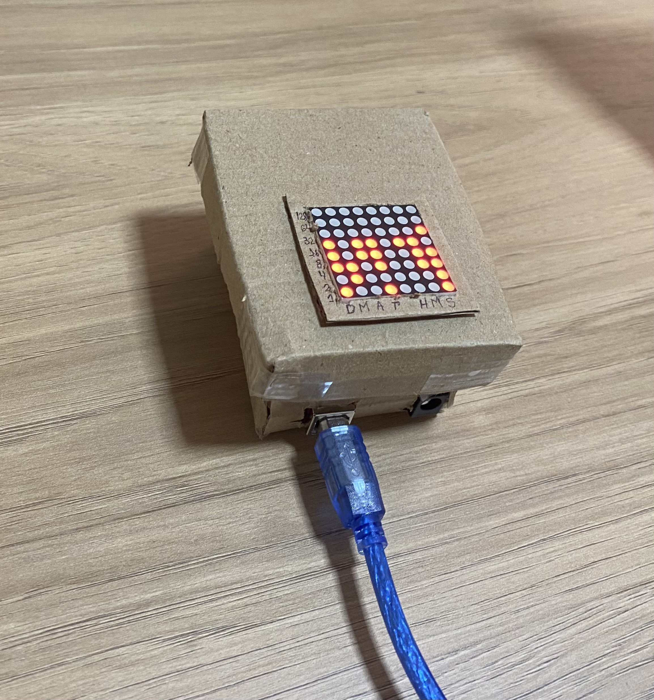

# Relógio Binário Arduino - SSC0180

## Resumo
Relógio/Termômetro binário utilizando uma placa Arduino.

O projeto foi feito durante a disciplina de Eletrônica para Computação na USP - São Carlos

## Tabela de Componentes
| Quantidade | Componente | Valor Unitário |
|------------|------------|-------|
| 01 | Placa Uno R3 Arduino | 44,99 |
| 01 | Módulo RTC DS3231 + Bateria | 34,90 |
| 01 | Matriz 8x8 Led MAX7219 | 30,90 |
|**Total:** |  | **110.79** |

## Funcionamento
O componente principal do projeto é o Módulo DS3231, um relógio de tempo real (RTC) extremamente preciso. Após configurá-lo corretamente uma vez, ele é capaz de manter o tempo de forma contínua, atualizando os dados do relógio do circuito cerca de 115 mil vezes por segundo. Essa precisão é alcançada através da compensação automática de variações de temperatura e dilatação do circuito, garantindo uma cronometragem extremamente precisa.

Além de fornecer informações temporais, o DS3231 também possui um termômetro interno cujos dados podem ser acessados via código Arduino. Isso permite obter, além da hora, a temperatura do ambiente.

Para exibir essas informações, utilizamos uma biblioteca disponível no software do Arduino para configurar um display de LEDs 8x8. Esse display é capaz de mostrar, em cada coluna, diferentes informações como dia, mês, ano, temperatura, hora, minuto e segundo, proporcionando uma visualização clara e eficiente dos dados coletados pelo módulo DS3231.



```cpp
#include <Wire.h>
#include "DS3231.h" // biblioteca modulo rtc e termometro
#include "LedControl.h" // biblioteca matriz de leds

const int display = 0; // display numero 0 (unico)
LedControl led = LedControl(5, 7, 6); // nossa matriz de leds

RTClib rtc; // saber da onde pegar a hora
byte info[12];// buffer do serial
int idx = -1; // indice do buffer

// setup dos modulos e do arduino
void setup() {
  led.shutdown (display,false); // liga o display
  led.setIntensity (display, 1); // seta o nivel de intensidade dos leds
  led.clearDisplay (display); // limpa o display
 
  Wire.begin();
 
  Serial.begin (115200); // seta o clock em baud
}

// loop principal do programa
void loop() {
  if (Serial.available()) { // se tem serial para ler
    acertaRelogioAgora(); // le o serial e trata a hora do relogio
  }
  DateTime agora = rtc.now(); // seta agora como o tempo atual
  
  // liga os leds convertendo int para sua representacao em binario e mandando
  // para a funcao da biblioteca LedControl, cada numero em uma coluna
  led.setRow (display, 7, agora.day());
  led.setRow (display, 6, agora.month());
  led.setRow (display, 5, agora.year() % 100);
  led.setRow (display, 2, agora.hour());
  led.setRow (display, 1, agora.minute());
  led.setRow (display, 0, agora.second());

  // puxa a temperatura do DS3231 e bota no display
  DS3231 Temp;
  float temp = Temp.getTemperature();
  int tempInt = (int) temp;
  led.setRow (display, 4, tempInt);
}

void acertaRelogioAgora() {
  int c = Serial.read(); // le um char do serial

  if (c == '<') { // comeco do serial, seta o indice pra 0
    idx = 0;
  } else if (c == '>') { // fim do serial, atualiza as informacoes do DS3231
    if (idx < 12) {
      Serial.print("Serial Invalido!!!");
    } else {
      DS3231 Clock;
      Clock.setClockMode(false);
      Clock.setDate(info[0]*10+info[1]);
      Clock.setMonth(info[2]*10+info[3]);
      Clock.setYear(info[4]*10+info[5]);
      Clock.setHour(info[6]*10+info[7]);
      Clock.setMinute(info[8]*10+info[9]);
      Clock.setSecond(info[10]*10+info[11]);
      Serial.println("A hora esta certinha!!!");
    }
    idx = -1;
  } else if ((idx >= 0) and (idx < 12) and (c >= '0') and (c <= '9')) { // guarda os numeros do serial em um vetor
    info[idx++] = (byte) (c - '0');
  }
}
```

## Esquemático no Frietzing


## Foto Do Projeto




## Link do Vídeo

## Professor Reponsável
Simões - https://gitlab.com/simoesusp

## Integrantes
Caroline Ueda - 15445630

Felipe Cerri - 15451119

Vitor Veiga - 15492449
